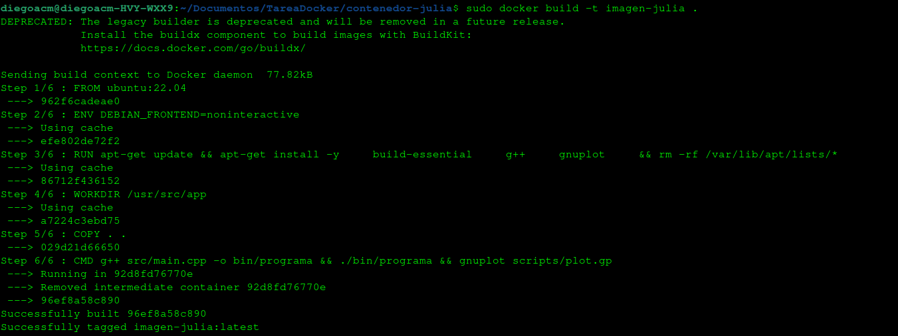
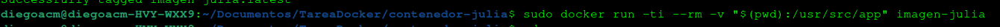
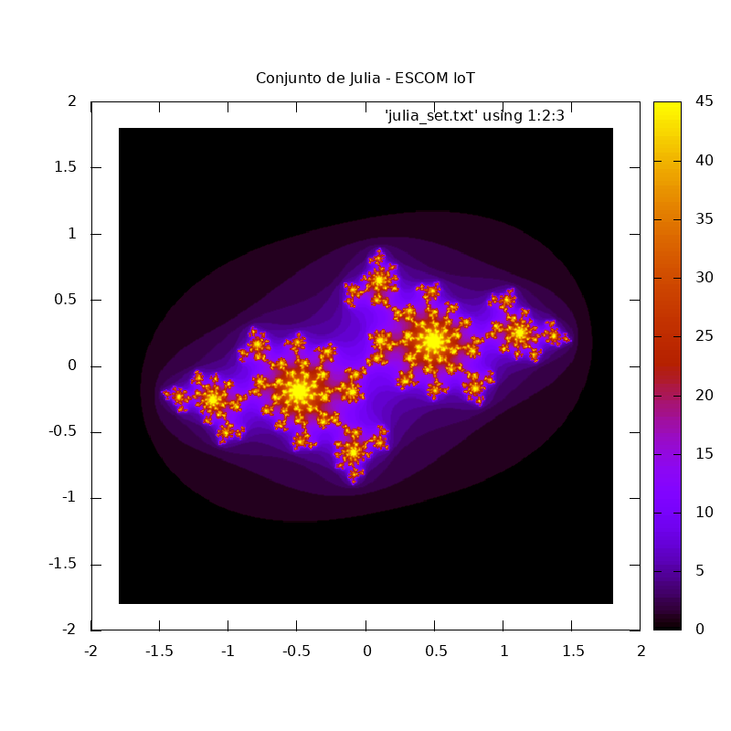
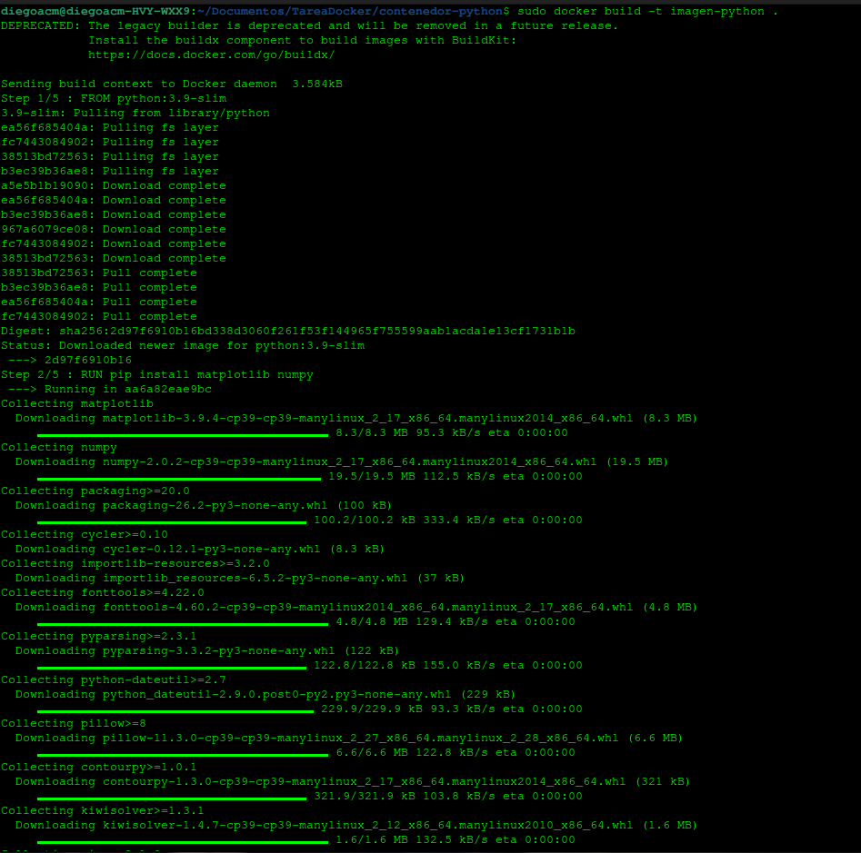
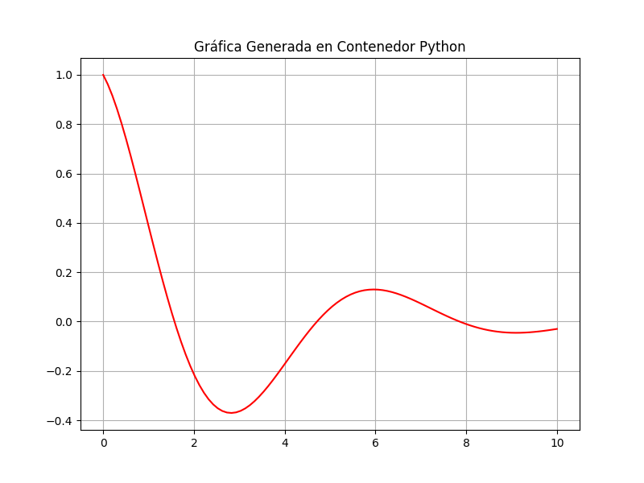
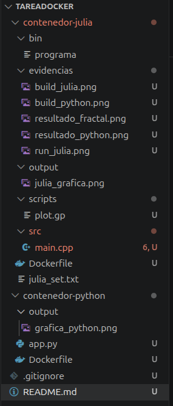

# Proyecto Docker y Git: Virtualización para Sistemas Embebidos e IoT

Este repositorio contiene el desarrollo y la documentación técnica de la implementación de contenedores Docker para la ejecución de aplicaciones en C++ y Python. El enfoque principal es demostrar la portabilidad de software y la consistencia de entornos de ejecución en el desarrollo de ingeniería.

---

## Metodología de Desarrollo y Virtualización

El proyecto se diseñó bajo el principio de **Infraestructura como Código (IaC)**. En lugar de instalar compiladores y librerías directamente en el sistema operativo anfitrión (Ubuntu), se definieron archivos de configuración (Dockerfiles) que dictan el entorno exacto necesario para cada tarea.

### ¿Por qué Docker en este proyecto?
1. **Aislamiento de Dependencias**: El contenedor de Julia utiliza `gnuplot` y `build-essential`, mientras que el de Python requiere un entorno interpretado con `matplotlib`. Ambos coexisten sin generar conflictos de versiones.
2. **Portabilidad**: El repositorio incluye todo lo necesario para que cualquier desarrollador con Docker instalado pueda replicar los resultados exactos sin configurar manualmente su sistema.
3. **Eficiencia en Capas**: Se utilizaron imágenes base oficiales para reducir la superficie de ataque y el tamaño del despliegue.

---

## Entorno 1: Generación de Conjunto de Julia (C++)

El código fuente implementa el algoritmo del **Conjunto de Julia**, un fractal que requiere cálculos iterativos con números complejos para determinar la convergencia de una función en el plano complejo.

### Procedimiento Técnico Detallado:
1. **Instalación Automatizada**: El Dockerfile actualiza los repositorios de Ubuntu e instala `g++` para la compilación y `gnuplot` para la salida gráfica.
2. **Ciclo de Vida**: 
   - El código en `src/main.cpp` se compila generando un binario en la carpeta `bin/`.
   - El binario genera un archivo de datos crudos `julia_set.txt`.
   - Se ejecuta un script de Gnuplot (`scripts/plot.gp`) que mapea esos datos a una imagen PNG.
3. **Sincronización de Volúmenes**: Se mapea la ruta local con `/usr/src/app` en el contenedor para extraer los resultados.

### Evidencias del Proceso (C++)

<table style="width:100%">
  <tr>
    <th style="text-align:center">Paso del Proceso</th>
    <th style="text-align:center">Captura de Pantalla</th>
  </tr>
  <tr>
    <td><b>1. Construcción de Imagen (Build):</b> Se muestra la creación de capas y la instalación de herramientas de compilación.</td>
    <td align="center">
      
    </td>
  </tr>
  <tr>
    <td><b>2. Ejecución del Contenedor (Run):</b> Confirmación de la compilación exitosa y generación del archivo de datos dentro del entorno aislado.</td>
    <td align="center">
      
    </td>
  </tr>
  <tr>
    <td><b>3. Resultado Visual:</b> Fractal del Conjunto de Julia generado mediante el mapeo de colores pm3d.</td>
    <td align="center">
      
    </td>
  </tr>
</table>

---

## Entorno 2: Análisis Estadístico (Python) - Contenedor Adicional

Se integró un segundo contenedor basado en **Python 3.9-slim** para demostrar la versatilidad de Docker en el manejo de librerías de alto nivel para Ciencia de Datos.

### Procedimiento Técnico:
1. **Gestión de Paquetes**: Uso de `pip` dentro del Dockerfile para instalar `numpy` (cálculo numérico) y `matplotlib` (visualización).
2. **Procesamiento de Señal**: El script `app.py` genera una señal senoidal amortiguada, simulando un sistema físico de segundo orden.
3. **Salida de Datos**: La gráfica se guarda directamente en la carpeta de salida vinculada al volumen.

### Evidencias del Segundo Contenedor (Python)

<table style="width:100%">
  <tr>
    <th style="text-align:center">Paso del Proceso</th>
    <th style="text-align:center">Captura de Pantalla</th>
  </tr>
  <tr>
    <td><b>Descarga de Capas (Build):</b> Proceso de "Pulling" de la imagen oficial de Python y configuración del entorno interpretado.</td>
    <td align="center">
      
    </td>
  </tr>
  <tr>
    <td><b>Ejecución y Gráfica:</b> Salida de la terminal y visualización de la gráfica estadística generada por Matplotlib.</td>
    <td align="center">
      
    </td>
  </tr>
</table>

---

## Configuración y Estructura del Repositorio

Para garantizar la limpieza del repositorio, se implementó un archivo `.gitignore` que evita la persistencia de binarios (`.o`, `.exe`) y archivos de datos temporales (`.txt`), manteniendo solo el código fuente y la documentación esencial.

### Organización de Carpetas:

---

### **Autor**
**Diego Aarón Cárdenas Mendoza** Estudiante de Ingeniería en Sistemas Computacionales  
**ESCOM - IPN**